# 데이터 실습 워크샵

## 1. Introduction 
<!-- 15분 -->

### 1.1 시작하기 전
<!-- 5분 -->
이 핸즈온랩에 여러분들은 가상 시나리오를 통해 아래 과정들을 간단하게 살펴볼 예정입니다. 
1) 데이터 분석을 위한 데이터 클렌징과 정규화 작업(Lab 2~3)
2) 쿼리를 통한 데이터 분석과 시각화 작업(Lab 4~5)
3) 데이터 예측 과정(Lab 6)

**Scenario** : ABC 회사는 온라인 반려동물 제품 소매업체입니다. 최근 반려동물을 위한 새로운 제품 라인을 출시했습니다. 큰 성공을 거둘 것으로 예상했지만 일부 지역의 매출이 기대에 미치지 못했습니다. 마케팅 조사에 따르면 해당 지역에서 제품에 대한 인지도가 낮은 것이 판매 부진의 주요 원인인 것으로 나타났습니다. 이 문제를 해결하기 위해 해당 지역에서 타겟팅된 메일 캠페인을 시작하여 인지도를 높이면서 제품 판매를 늘리려고 합니다. 팀은 코딩을 하거나 인프라를 관리할 시간이 많지 않기 때문에 손쉽게 이를 해결할 수 있는 방법이 필요합니다.

**Action** : 팀은 1) 고객/제품/판매 데이터를 분석 및 변환하여 두 제품 라인(신규/기존)의 판매를 비교하고, 2) 특정 제품을 마케팅할 고객의 우편번호를 파악해야 합니다.

**데이터 변환 단계**:
1. 고객 데이터 (Customer) : 고객 데이터를 클징하고, 주소 컬럼에서 우편번호를 분석합니다.
1. 판매 데이터 (Sales): 고객 데이터 및 제품 데이터와 Join하여, 우편번호 및 제품 유형별로 판매량을 비교합니다.
1. 제품 데이터 (Product) : 캠페인을 위한 시장성있는 제품 ID가 포함된 우편번호 목록을 생성합니다.

**Data Model**


 
**Logical data flow**


### 1.2 이벤트 계정으로 AWS 콘솔 접속 하기
<!-- 10분 -->
1. AWS Wokshop Portal에 로그인하여 실습을 진행하실 경우 Team Hash 값이 필요합니다. 여기를 클릭 한 후, 이벤트 주최자로부터 받은 12자리 Participant Hash 값을 입력하면 오른쪽 하단 버튼이 **Accept Terms & Login**으로 변경됩니다. 다음 단계로 넘어가기 위해 해당 버튼을 클릭합니다.

    

1. **Email One-Time Password (OTP)** 버튼을 클릭합니다.

    

1. 본인의 이메일 계정을 입력하고 **Send Code** 버튼을 클릭합니다.

    

1. 작성한 이메일 수신함에서 제목이 Your one-time passcode 인 이메일을 확인하고 passcode를 복사합니다. 복사한 passcode를 아래와 같이 붙여넣기 한 뒤, **Sign in** 버튼을 클릭합니다.

    

1. 다음 화면에서 **AWS Console** 버튼을 누르면 AWS 관리콘솔에 로그인할 수 있는 로그인 링크를 받을 수 있습니다.

    

1. **Open AWS Console** 버튼을 누르면 AWS 관리콘솔로 접속할 수 있습니다. 또한, CLI 환경을 위한 "Access Key" 와 "Secret Access Key" 도 확인할 수 있습니다.

    

위의 단계를 모두 수행했다면 이제 실습을 시작할 수 있습니다.

### 1.3 S3버킷 생성하기(CloudFormation)
<!--  5분 -->
1. 오른쪽 상단에 **US East (N. Virginia) us-east-1** 리전을 사용하고 있는지 확인합니다.
    

1. 워크샵을 시작하기 전에 필요한 AWS 리소스를 생성해야 합니다. 이를 위해 리소스가 포함된 스택을 생성할 수 있는 AWS CloudFormation 템플릿을 제공합니다. 스택을 생성하면 AWS가 계정에 여러 리소스를 생성합니다. 이 워크샵에서는 사용할 데이터 파일 및 폴더와 함께 *glue-databrew-immersionday*으로 시작하는 S3 버킷을 생성합니다. 아래의 Launch Stack 버튼을 클릭하여 이 워크샵에 필요한 리소스를 생성합니다. CloudFormation 스택을 완료하는데 대략 3~5분 정도 소요됩니다. 
[](https://us-east-1.console.aws.amazon.com/cloudformation/home?region=us-east-1#/stacks/create/review?templateURL=https://aws-data-analytics-workshops.s3.amazonaws.com/glue-databrew-immersionday-v2/databrew_ID-prod.yaml&stackName=glue-databrew-immersionday)

    

1. 스택 생성이 성공하면 **Outputs** 탭에서 새로 생성된 버킷 이름을 확인할 수 있습니다.

    

1. AWS 콘솔 상단 검색 창에서 **S3**로 검색하여, S3 서비스로 이동합니다. 

    

1. Buckets 메뉴를 클릭합니다. *glue-databrew-immersionday*으로 시작하는 S3 버킷을 확인할 수 있습니다.   

    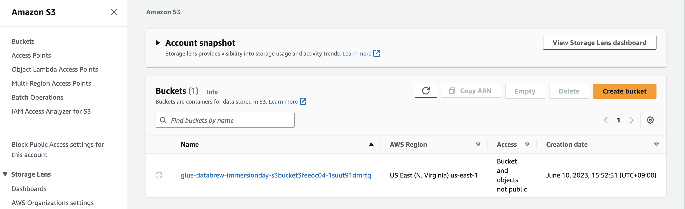

1. *glue-databrew-immersionday* 버킷에는 다음과 같은 구조를 가지고 있습니다.

    

## 2. Profiling and Data Quality
<!-- 30분 -->
AWS Glue DataBrew는 데이터 패턴을 이해하고, 이상 징후를 감지하기 위해 데이터를 프로파일링하여 데이터의 품질을 평가할 수 있도록 도와줍니다. Dataset의 Data profile overview 섹션에서 데이터에 대한 통계 요약을 검토하고 수집할 수 있습니다.

   

Lab2에서는 아래 내용들을 확인해보겠습니다.

- Data Profile Job 만들기
	- 개인 식별 정보(Personal identifiable information, PII) 데이터 탐지
	- Data Quality(DQ) 검사
- Data Lineage 확인하기

### 2.1 Customer Dataset

Dataset은 단순히 열 또는 필드로 나뉜 데이터 행 또는 레코드 집합을 의미합니다. DataBrew는 형식이 지정된 파일에서 가져온 모든 소스의 데이터로 작업할 수 있으며, 데이터 저장소 목록에 직접 연결할 수 있습니다. DataBrew에서 데이터 집합은 데이터에 대한 읽기 전용 연결입니다. DataBrew는 데이터를 참조하기 위해 일련의 메타데이터를 수집합니다. 실제 데이터는 DataBrew에서 변경하거나 저장할 수 없습니다. 즉, Dataset은 실제 Dataset과 DataBrew가 사용하는 메타데이터를 모두 의미합니다.

이 실습에서는 Customers dataset을 만듭니다. 아래는 샘플 고객 데이터입니다.
   
   

1. AWS 콘솔 상단 검색 창에서 **DataBrew**로 검색하여, [AWS Glue DataBrew](https://console.aws.amazon.com/databrew/home?region=us-east-1#)서비스로 이동합니다.
1. 왼쪽 메뉴에서 **DATASETS**를 선택합니다.
1. **Connect new dataset** 버튼을 클릭합니다.

   

1. dataset의 이름을 `Customers`로 지정합니다.
1. 서비스로 **Amazon S3**를 선택합니다.
1. **Enter your source from S3**에 `*s3://glue-databrew-immersionday`를 입력합니다. CloudFormation 템플릿으로 생성한 버킷을 선택합니다.
1. **datafiles > customers** 폴더로 이동합니다.
1. *customer.csv* 파일을 체크합니다.

   

1. file type으로 **CSV**를 선택합니다.
1. **Comma(쉼표)**를 CSV 구분 기호로 선택합니다.
1. **Treat first row as header(첫 번째 행을 헤더로 처리)**를 선택합니다.
1. 오른쪽 아래에 있는 **Create dataset** 버튼을 선택합니다.

   

1. Customers Dataset이 생성됩니다.

   

1. Customers Dataset을 선택하여 고객 데이터를 미리 확인해봅니다.

   

다음으로 DataBrew 프로젝트를 생성합니다.

### 2.2 Customer Profile Job (Personal identifiable information, PII)

프로파일링 작업은 dataset에 대해 다양한 평가를 실행합니다. 데이터 프로파일링이 수집하는 정보는 어떤 종류의 데이터 준비 단계가 필요할지 결정하는 데 도움이 됩니다.
이 LAB에서는 프로필 작업에서 PII 탐지 기능을 활성화하여 dataset에 있는 민감한 개인 식별 정보(PII) 데이터를 식별합니다.

1. 왼쪽 메뉴에서 **DATASETS**를 선합니다.
1. 이전 단계에서 만든 **Customers** dataset을 선택합니다.
1. 오른쪽 상단에서 **Run data profile**을 선택합니다.

   

1. **Create a profile job**를 선택합니다.

   

1. Job 이름으로 `Customers profile job` 입력합니다.
1. **Full dataset**을 선택합니다.

   

1. Browse 버튼을 클릭하여 **glue-databrew-immersionday-xxxx S3 버킷 > profile-output 폴더**를 선택 후 **Select 버튼**을 클릭합니다.

   

1. **Data profile configurations**을 확장하고, 데이터 프로필 작업을 실행 시 PII 컬럼 식별을 위해 **PII statistics**에서 **Enable PII statistics**을 선택합니다. 그 다음으로 **PII categories**에서 **All categories**를 선택합니다.

   

1. **Permissions** 섹션으로 건너뛰고, **Role name** 드롭다운하여 **Create new IAM role**를 선택합니다.
1. **New IAM Role suffix**으로 `ID`를 입력합니다. 그러면 AWSGlueDataBrewServiceRole-ID라는 새 IAM role이 생성됩니다.
1. **Create and run job**을 선택합니다.

   

1. 그러면 **Customers** dataset의 **Data profile overview** 탭으로 이동합니다.
작업이 완료되는 데 약 5분이 소요됩니다.

   

1. 이 보고서는 컬럼 통계와 함께 PII 대상으로 확인된 PII 컬럼의 카탈로그를 제공합니다. 또한 검토할 수 있는 잠재적인 PII 열을 보여줍니다.
이후 과정에서는 변환을 통해 확인된 PII 컬럼을 수정할 예정입니다. 다음 LAB에서 Sales Dataset 및 Data Quality Rules을 생성하겠습니다.

### 2.3 Sales Dataset

이 실습에서는 Sales Dataset을 만듭니다. 아래는 샘플 판매 데이터입니다.

   

1. 왼쪽 메뉴에서 **DATASETS**를 선택합니다.
1. **Connect new dataset** 버튼을 클릭합니다.

   

1. dataset 이름을 `Sales`로 지정합니다.
1. 서비스로 **Amazon S3**를 선택합니다.
1. **Enter your source from S3**에 `s3://glue-databrew-immersionday`를 입력합니다. CloudFormation 템플릿으로 생성한 버킷을 선택합니다.
1. **datafiles > sales** 폴더를 선택합니다.

   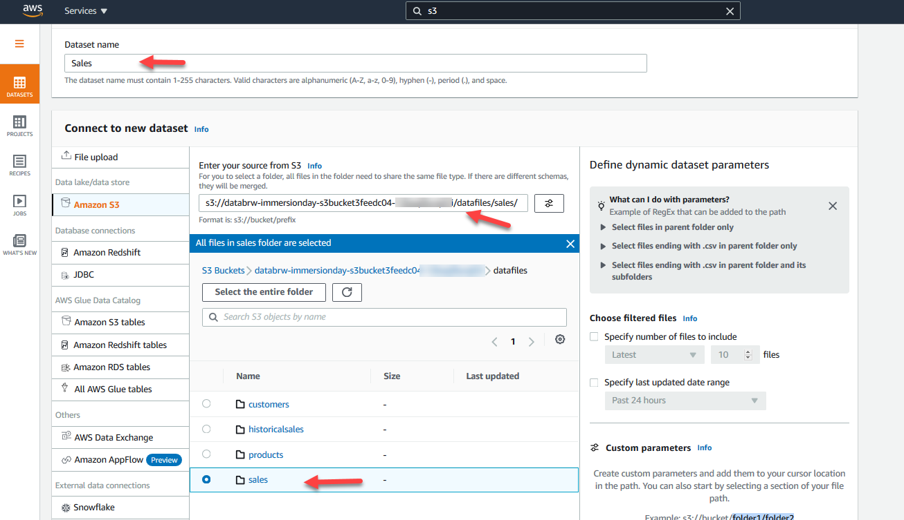

1. file type으로 *CSV*를 선택합니다.
1. **Comma(쉼표)**를 *CSV* 구분 기호로 선택합니다.
1. **Treat first row as header**(첫 번째 행을 헤더로 처리)를 선택합니다.
1. 오른쪽 아래에 있는 **Create dataset** 버튼을 선택합니다.

   

1. Sales Dataset이 생성됩니다. **Sales Dataset**을 선택하여, 고객 데이터를 미리 확인해봅니다.

   

다음으로 data quality rules과 data profiling job을 만들어보겠습니다.

### 2.4 Sales Profile Job (DQ)

이 실습에서는 Sales dataset의 data quality을 확인하고, data quality ruleset을 만든 다음 profile job을 실행하여 적용합니다.
1. 왼쪽 메뉴에서 **DQ Rules**을 선택하고, **Create data quality ruleset** 버튼 클릭합니다.

    

1. **Ruleset** 이름을 `Sales DQ Checks`로 지정합니다.
1. **Associated dataset** 섹션에서 **Sales** dataset을 선택합니다. **View associated dataset details**를 클릭하여 dataset을 미리 확인합니다.
1. 이제 dataset을 미리 볼 수 있으며, Sales dataset의 *Quality, Total_Sales*컬럼에 data quality 문제가 있음을 확인할 수 있습니다.

    

1. 또한 적용할 수 있는 data quality check에 대한 **Recommendations**(권장 사항)도 확인할 수 있습니다.

    

    **DATASET QUALITY CHECKS** : 중복 행이 있는 dataset 있는지 확인
    **COLUMN QUALITY CHECKS** : 모든 컬럼에 missing values가 0% 인지 확인

    여러 규칙을 추가할 수 있으며, 각 규칙 내에서 여러 데이터 품질 검사를 정의할 수 있습니다.

1. 첫 번째 Rule 이름으로 `Duplicate rows` 입력합니다. Rule 1 에 대해 아래 옵션을 선택합니다:

    **Data quality check scope**(검사 범위) : **Individual check for each column**(각 컬럼에 대해 개별 검사) 선택

    **Rule success criteria**(규칙 성공 기준) : **All data quality checks are met (AND)** (모든 데이터 품질 검사 충족) 선택

    **Data quality checks** : 드롭다운하여 **Duplicate rows(중복 행)** 선택

    **Condition(조건)** : **Is equals(같음)** 선택

    **Value** : `0`을 입력, 드롭다운하여 **rows** 선택

    **Rule Summary**에서 설정한 규칙에 대한 설명을 확인할 수 있습니다.
    Dataset에 중복 행 수가 == 0인 경우 규칙이 통과됩니다.

    

1. **Add another rule**를 클릭하여 dataset에 데이터 품질 검사를 추가하고, 두번째 규칙 이름으로 `Quantity and total Sales should be >0` 입력합니다. Rule 2 에 대해 아래 옵션을 선택합니다:

    **Data quality check scope**(검사 범위) : **Common checks for selected columns**(선택한 컬럼에 대한 공통 검사) 선택

    **Rule success criteria**(규칙 성공 기준) : **All data quality checks are met (AND)** (모든 데이터 품질 검사 충족) 선택

    **Selected columns** : **Selected columns** 선택

    **Column values** : *Quantity*와 *Total_Sales*을 두 개를 선택하여 **select columns** 클릭

    **Data quality check** : **Column values** 드롭다운하여 **Numeric values** 선택

    **Condition** : **Greater than(다음보다 큼)** 선택

    **Value**에 **Custom value**으로 `0`을 입력

    **Threshold(임계값)** : Condition를 드롭다운하여 **Greater than equals**을 선택, **Threshold(임계값)**을 `100`, **%(percent) rows** 으로 설정합니다.

    **Rule Summary**에서 설정한 규칙에 대한 설명을 볼 수 있습니다.
    모든 컬럼이 Quantity, Total_Sales의 값 >= 0인 경우 규칙이 통과됩니다.
    
    

1. 이제 데이터 품질 검사를 시작할 준비가 되었습니다. **Create ruleset** 버튼을 클릭하여 데이터 품질 검사를 저장합니다.

     

1. 그러면 **DQ RULES**메뉴에 **Data quality rulesets**으로 이동합니다. Sales dataset에 새 규칙 집합을 적용하기 위한 profile Job을 만들기 위해

    **Sales DQ Checks**를 선택하고, **Create profile job with ruleset** 를 선택합니다.
    
    

1. job 이름으로 `Sales profile job`을 입력하고, **Full dataset**을 선택합니다.
    
     

1.  **Job output settings**의 경우, Browse 버튼을 클릭하여 **glue-databrew-immersionday-xxxx S3 버킷 > profile-output 폴더**를 선택 후 **Select** 버튼을 클릭합니다.

     

1. **Data quality rules** 섹션에서 **Sales DQ Checks** 규칙 집합이 이미 적용되어 있는 것을 볼 수 있습니다.
1. 나머지는 optional 설정은 default settings을 그대로 유지하고, **Permissions** 섹션의 **Role name**를 드롭다운하여 *AWSGlueDataBrewServiceRole-ID* 역할을 선택합니다.
1. 오른쪽 하단에 **Create project**을 선택합니다.

     

Profile jobs은 dataset에 대해 평가를 실행합니다. dataset 수준과 컬럼 수준으로 세분화하여 통계를 생성합니다.

1. 그러면 **Sales Datasets**의 **Data profile overview** 탭으로 이동합니다. 작업이 완료되는 데 약 5분이 소요됩니다.

     

1. **Value distribution**(값 분포)를 확인합니다.

     

1. **Columns statistics** 탭을 선택합니다.

     

1. **Data quality rules** 탭을 선택하면 데이터 품질 검사에 모두 실패한 것을 확인할 수 있습니다.

     

1. 이후 Lab4에서 데이터 품질 문제가 있는 행을 필터링하기 위해 변환을 수행합니다.

### 2.5 Data Lineage

데이터의 계보를 시각적으로 매핑하여 데이터가 거쳐 온 다양한 데이터 원본과 변환 단계를 파악할 수 있습니다.

1. 왼쪽 메뉴에서 **DATASETS**를 선택합니다. **Sales** dataset을 선택합니다.
1. **Data lineage** 탭을 선택하여 다음을 확인합니다.

     

1. 해당 dataset의 모든 작업을 보기 위해 **CloudTrail logs**를 선택합니다.

     

## 3. Standard Transform
<!-- 20분 -->
이 실습에서는 name 컬럼을 표준화 및 결합하고, address 컬럼을 분리하여 customer data를 정리하고 변환합니다.
     

다음 방법을 실습하게 됩니다.
- Project 만들기
- Recipe 빌드
- Job 생성

### 3.1 Create Project

DataBrew의 대화형 데이터 준비 작업 공간을 project라고 합니다. data project를 사용하여 데이터, 변환 및 예약된 프로세스와 같은 관련 항목 아이템을 관리합니다. 프로젝트 생성의 일부로 작업할 dataset을 선택하거나 만듭니다. 그런 다음, DataBrew가 실행할 일련의 지침 또는 단계인 recipe를 만듭니다. 이러한 작업을 통해 raw data를 분석이나 예측을 위한 데이터 파이프라인에서 사용할 수 있는 형태로 변환합니다.

이제 dataset이 만들어졌으므로, 데이터 변환을 시작할 수 있습니다.

1. 왼쪽 메뉴에서 **PROJECTS**를 선택합니다.
1. 오른쪽 상단 메뉴에서 **Create project** 버튼을 클릭합니다.
1. project 이름을 `CleanCustomer`로 지정합니다. 자동 입력된 Recipe 이름은
 그대로 둡니다.
1. **My datasets**을 선택합니다.
     

1. 이전 실습 모듈에서 만든 **Customers** dataset을 선택합니다.
1. **Sampling** 섹션을 열고 Type을 **Random rows**로 설정합니다.
1. 샘플 크기로 **1,000**을 선택합니다.

     

1. **Permissions** 섹션의 **Role name**를 드롭다운하여 앞서 생성했던 *AWSGlueDataBrewServiceRole-ID* 역할을 선택합니다.
1. 오른쪽 하단에 **Create project**을 선택합니다.

     

새 프로젝트를 초기화하는 데 몇 분 정도 걸립니다.

### 3.2 Build Recipe

recipe는 데이터에 대한 일련의 지침 또는 단계로, DataBrew가 작동하도록 하려는 데이터입니다. recipe에는 여러 단계가 포함될 수 있으며, 각 단계에는 여러 작업이 포함될 수 있습니다. toolbar의 transformation 도구를 사용하여 데이터에 적용하려는 모든 변경 사항을 설정할 수 있습니다. DataBrew는 데이터 변환에 대한 지침을 저장하지만 실제 데이터는 저장하지 않습니다. 프로젝트는 기본적으로 데이터 집합의 첫 번째 샘플 n개를 로드합니다. DataBrew는 dataset에 대한 통계를 자동으로 생성하고 데이터의 그리드(샘플 데이터 집합의 표 형식, Excel과 비슷한 시각화), 스키마 및 프로필(전체 dataset에 대한 통계) 보기를 제공합니다.

이 실습에서는 병합 및 포맷 변환을 사용하여 Name 컬럼을 표준화합니다. Format transform을 사용하여 DoB(생년월일) 컬럼을 표준화합니다. 다음으로, Clean과 SPLIT transform을 사용하여 Address 컬럼을 표준화합니다. 마지막으로 PII 데이터를 수정합니다.

1. 이전 단계에서 만든 **CleanCustomer** 프로젝트를 엽니다.

1. 상단 메뉴에서 **MERGE 아이콘**을 선택합니다.

     

1. 오른쪽에서 Source Column으로 *Prefix, First_Name, Last_Name* 컬럼을 선택합니다.
1. 공백 문자(` `)를 **separator**(구분 기호)로 입력합니다.

     

1. **New column** 이름으로 `Name`을 입력합니다.
1. **Preview changes**를 클릭하고, 미리 보기에서 예상한 결과가 표시되는지 확인합니다. **Apply**를 클릭합니다.

     

1. 생성한 새 컬럼 위에 표시되는 **줄임표**(...)를 선택합니다.
1. 표시되는 메뉴에서 **Format > Change to capital case(대문자로 변경)** 선택합니다.

     

1. 오른쪽 하단에 **Apply** 버튼을 클릭합니다.

     

1. 상단 메뉴에서 **COLUMN 아이콘 > Delete**를 선택하고, *Middle_Name*과 *Suffix*를 source columns으로 선택한 다음 **Apply** 버튼을 클릭합니다.

     

1. **DoB 컬럼 위의 줄임표**(...)를 선택하고 표시되는 메뉴에서 **Format > Date-time formats > mm-dd-yyyy**를 선택합니다.

     

1. 오른쪽 하단에 **Apply** 버튼을 클릭합니다.

     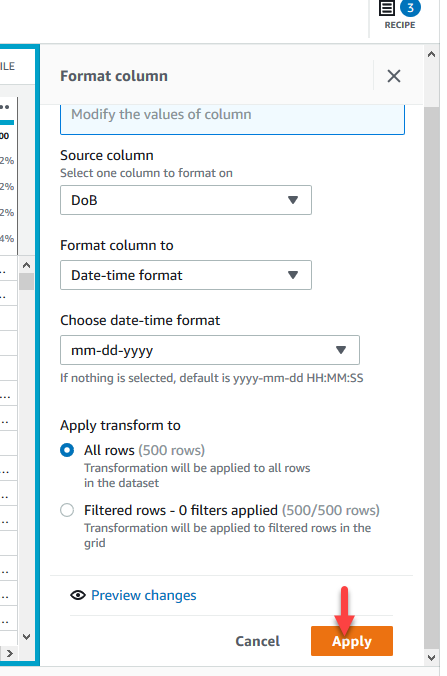

1. Address 컬럼에서 특수 문자 <>&을 제거합니다. Address 컬럼 헤더에서 줄임표(...)를 선택한 다음 **Clean > Special Character**를 선택합니다.

     

1. 오른쪽에서 source column으로 Address 컬럼을 확인하고, **Custom special characters** 를 선택하여 입력란에 `<>&`을 입력합니다.

     

1. **Apply transform to** 섹션에서 **All rows(모든 행)**을 선택한 상태로 둡니다.
1. **Preview changes**를 선택하고 결과가 예상대로 표시되는지 확인합니다.
1. 오른쪽 하단에 **Apply** 버튼을 클릭합니다.

     

1. 다음으로 Address 컬럼을 우편번호와 분리합니다. 상단 메뉴에서 **SPLIT 아이콘**을 선택하고, **On a single delimiter**을 선택합니다.

     

1. **Address**를 *source column*으로 선택하고 **split column options**은 *기본값*으로 둡니다.

     

1. **Enter custom value**에 **delimiter**(구분 기호)로 `;` 를 입력합니다.
1. **number of times to split**(분할할 횟수)를 *4*로 설정합니다.
1. **Apply transform** 섹션에서 *All rows*(모든 행)을 선택한 상태로 둡니다.
1. **Preview changes**를 선택하여 결과를 확인합니다.
1. **Apply**을 선택합니다.

     

    **다음 단계에 따라 Address_3의 이름을 City로, Address_4의 이름을 Zip으로, Addrees_5의 이름을 Country로 변경합니다.**

1. 각 컬럼 상단의 **줄임표**(...)을 선택한 다음, 메뉴에서 **Rename**를 선택합니다.
1. **New column** 이름으로 대상 이름(Address_3 > `City`, Address_4 > `Zip`, Addrees_5 > `Country`)을 입력하고 **Apply** 선택하여, 컬럼의 이름을 변경해줍니다.

     

1. **Customers dataset**에서 PII 데이터를 수정하려면 *SENSITIVE 아이콘 > Data masking > Redact values* 선택합니다.
1. 오른쪽 Source 컬럼에서 *DoB, Address_1, Address_2*를 선택하고 **Apply**를 선택합니다. 이제 *DoB, Address_1, Address_2* 컬럼이 *#* 값으로 수정된 것을 확인할 수 있습니다.

1. 상단 메뉴의 가장 오른쪽에 있는 **RECIPE**를 선택하여, RECIPE를 열고 아래와 같은 10단계가 포함되어 있는지 확인합니다.

     

다음으로, 위의 recipe를 사용하여 raw Customers data를 clean된 고객으로 변환하는 DataBrew 작업을 만들 것입니다.     

### 3.3 Create Job

DataBrew는 recipe를 만들 때 설정한 지침을 실행하여, 데이터를 변환하는 작업을 수행합니다. 이러한 지침을 실행하는 프로세스를 Job이라고 합니다. Job은 미리 설정된 일정에 따라 데이터 레시피를 실행하거나 필요에 따라 Job을 실행할 수도 있습니다. 일부 데이터를 프로파일링하려는 경우에는 recipe를 만들 필요없 profile job을 설정하여 data profile을 만들면 됩니다.

1. 오른쪽 상단 메뉴에서 Create Job 를 선택합니다.

     

1. **Job** 이름으로 `CleanCustomer`를 입력합니다.
1. Job의 출력 위치를 지정해야 합니다. DataBrew는 단일 작업에서 여러 가지 형식의 출력을 생성할 수 있는 유연성을 제공합니다. 
**Job output settings**에 **File type** 드롭다운하여 *CSV*를 선택합니다.
1. **Browse 버튼**을 클릭하여 이전에 생성한 **glue-databrew-immersionday-xxxx** S3 버킷을 클릭합니다.

     

1. **shared 폴더**를 선택합니다.
1. **Select 버튼**을 클합니다.

     

1. **Advanced job settings** 섹션을 열고 *Maximum number of units*에 `5`를 입력합니다.
1. **Permissions** 섹션의 **Role name**를 드롭다운하여 *AWSGlueDataBrewServiceRole-ID* 역할을 선택합니다.
1. 오른쪽 하단에 **Create project**을 선택합니다.

     

1. CleanCustomer JOB이 실행되고 **Job output** 항목에 **output**에 대한 링크가 생깁니다.

     

1. **output** 링크를 클릭하면 출력 파일의 위치가 표시됩니다.

     

1. **S3 Destination URL**을 클릭하면 첫 번째 Job 실행의 출력 파일이 들어 있는 폴더가 표시됩니다.

     

## 4. Advanced Transform

### 4.1 Join and Group By

이 실습에서는 Join(조인) 및 Group By(그룹화) 변환을 사용하여 제품 ID, 우편번호 및 제품 유형별로 총 매출을 계산합니다

1. 왼쪽 메뉴에서 **PROJECTS**를 선택합니다.
1. 오른쪽 상단 메뉴에서 **Create project** 버튼을 클릭합니다.
1. **Project**이름으로 `Sales`를 입력합니다.
1. **Select a dataset** 섹션에서 **My datasets**을 선택한 다음 **Sales**를 선택합니다.

     

1. **Permissions** 섹션의 **Role name**를 드롭다운하여 *AWSGlueDataBrewServiceRole-ID* 역할을 선택합니다.
1. 오른쪽 하단에 **Create project**을 선택합니다.

     

새 프로젝트를 초기화하는 데 몇 분 정도 걸립니다.
1. 먼저 **Sales** dataset에서 데이터 품질 문제가 있는 rows을 필터링해 보겠습니다.
1. 상단 메뉴에서 **FILTER**를 선택하고 **By condition .png"> Greater than**을 선택합니다.
     
1. **Source column** 드롭다운에서 **Quantity**을 선택하고 **Filter condition**(필터 조건)을 *Greater than 0* (값 0보다 큼)으로 적용합니다.
미리 보기에서 필터링될 행이 조건을 충족하지 않으면, 취소선으로 강조 표시된 것을 확인할 수 있습니다.
     
1. **Apply**를 클릭합니다. 왼쪽 상단 모서리에 행 수가 (500행)에서 (496행)으로 줄어든 것을 볼 수 있습니다.
1. **Total_Sales** 행도 동일한 단계를 반복해 보겠습니다. **FILTER**를 선택하고 **By condition .png"> Greater than**을 선택하여, Total_Sales 컬럼이 Greater than 0 (0 값보다 큼)을 유지합니다.
     
1. **Apply**를 클릭합니다. 왼쪽 상단 모서리에 행 수가 (496행)에서 (491행)으로 줄어든 것을 확인할 수 있습니다.
1. **duplicate rows**(중복 행)을 제거하려면, 상단 메뉴에서 **DUPLICATES**를 선택하고 **Delete duplicate rows**를 선택합니다.
     
1. **Apply을 클릭하여**, sample dataset에 있는 중복 행 10개를 제거합니다. 이제 행 수가 (481행)이 되어야 합니다. 
모든 데이터 품질 이슈를 처리했습니다.
     

1. 이 Standard Transform 단계에서 만든 Clean Customer 데이터와 이 Sales dataset과 조인합니다. 상단 메뉴에서 JOIN을 선택합니다.
     
상단 메뉴 표시줄에 JOIN이 보이지 않는다면 MORE 섹션에서 찾을 수 있습니다.
1. Standard Transform 단계에서 생성한 CleanCustomer output을 사용하여 새로운 Dataset을 만들려고 합니다. Connect new dataset을 선택합니다.
     
1. **Dataset name**을 `CleanCustomer`로 입력한 후 **'Amazon S3'**를 선택합니다. **Enter your source from S3**에 `s3://glue-databrew-immersionday`를 입력합니다. CloudFormation 템플릿으로 생성한 버킷을 선택합니다. 
**shared .png"> CleanCustomer_Date_Timestamp** 폴더로 이동합니다.
     
1. 폴더에서 csv 파일을 선택합니다. (참고: 날짜와 타임스탬프는 CleanCustomer 작업이 실행된 날짜와 시간과 일치합니다.)
Additional configuration 에서 **Selected file type**을 *CSV*로 지정하고 **Create dataset**를 선택합니다.
     
1. 새 dataset 집합 미리 보기가 표시됩니다. **Next**을 선택합니다.
     
1. **Inner join** 옵션을 선택합니다. Table A 드롭다운에서 *Customer_id*를 선택하고 Table B 드롭다운에서 *Customer_ID*를 선택합니다. 그리고 아래 두 스크린샷에 따라 컬럼을 선택하고 **Finish**을 선택합니다.
     
     
1. 다음으로 Product data를 join합니다. 위와 유사하게 상단 메뉴 모음에서 Join 옵션을 선택하고 Connect new dataset을 선택합니다.
1. **Dataset name**을 `Product`로 입력한 후 **''Amazon S3'**'를 선택합니다. **'Enter your source from S3**에 `s3://glue-databrew-immersionday`를 입력합니다. CloudFormation 템플릿으로 생성한 버킷을 선택합니다. 
폴더에서 csv 파일을 선택합니다. **datafiles .png"> products** 폴더로 이동합니다. Additional configuration 에서 **Selected file type**을 *CSV*로 지정하고 **Create dataset**를 선택합니다.
     
1. Product dataset 미리 보기가 표시됩니다. **Next**을 선택합니다.
1. **Inner join** 옵을 선택합니다. Table A 드롭다운에서 *Product_id*를 선택하고 Table B 드롭다운에서 *Product Key*를 선택합니다. 그리고 아래 두 스크린샷에 따라 컬럼을 선택하고 **Finish**을 선택합니다.
     
     
1. **Zip 컬럼 헤더**에서 *#*을 클릭하여 **Zip data type**을 *integer(정수)*로 변경합니다.
     
1. 스크린샷에 따라 COLUMN .png"> Delete를 선택하여 *불필요한 Source Columns(Txn_Date, Customer_Id 및 Quantity)*을 삭제합니다.
1. 상단 메뉴에서 Group 선택합니다.
     
1. 아래 스크린샷과 같이 Product_Id, Zip, Product_Type를 대상으로 **Column names과 Aggregate(집계 함수)**를 선택하고 **Finish**을 선택합니다.
해당 결과로 Product_Id, Zip, Product_Type별로 총 매출을 Sum하는 recipe가 생성됩니다.
     
1. recipe를 Publish하여 새 버전의 recipe를 만듭니다. 이렇게 하면 게시된 recipe 버전을 recipe Job의 옵션으로 선택할 수 있습니다. 
 recipe를 확인한 후 **Publish**를 선택합니다.
     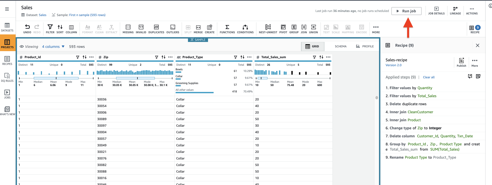
1. **Version description**으로 `Total-Sales`을 입력하고 게시를 선택합니다.
     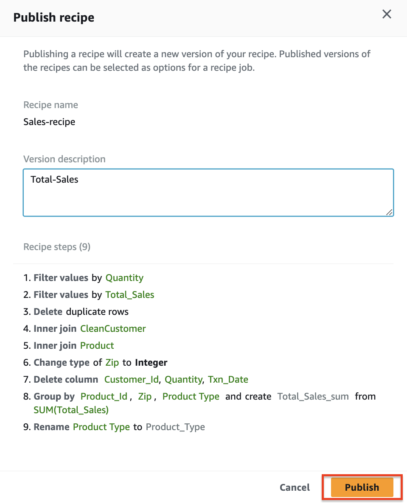
1. 마지막으로 이 recipe를 사용하여 전체 sales dataset에 대해 총 판매량을 생성하는 작업을 만듭니다. **Create job**을 선택합니다.
     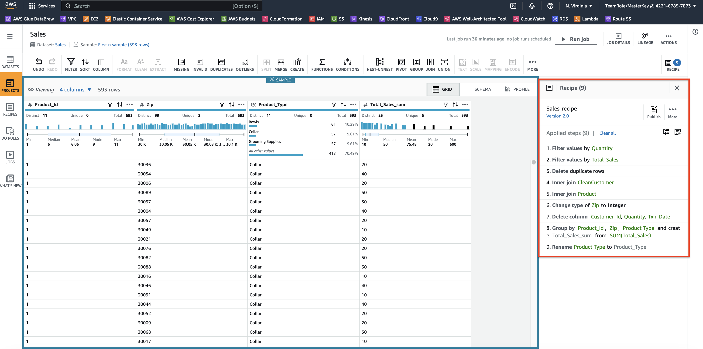
1. **Job name**을 `Total-Sales`로 지정합니다.
1. 작업의 출력 위치를 지정해야 합니다. **Job output settings**에서 **File Type**으로 *"CSV"*를 선택합니다.
1. **Browse**를 선택하여 S3 위치를 선택하고 텍스트 상자에 `glue-databrew-immersionday`를 이전에 생성한 S3 버킷 위치를 선택합니다. **shared 폴더**를 **Select**를 클릭합니다.
     
1. **Permissions** 섹션의 **Role name**를 드롭다운하여 *AWSGlueDataBrewServiceRole-ID* 역할을 선택합니다.
1. 오른쪽 하단에 **Create project**을 선택합니다.
     
1. 작업이 성공적으로 실행되면. Output은 s3에 기록됩니다.
     

### 4.2 Pivot and Custom Recipe

이 실습에서는 Pivot 변환을 총 판매액으로 사용하여 **product Type - Toys - Campaign**에 대한 우편번호를 식별합니다. 이 실습에서는 custom recipe를 사용하는 방법을 배웁니다.

1. cloudformation 템플릿으로 생성한 g**lue-databrew-immersionday** s3 버킷의 **recipes/** 폴더에서 *ID-recipe-import.json*을 다운로드합니다.
     
1. **project name**으로 `SalesByProductType-Toys` 를 입력합니다. **Recipe detail** 섹션에서 **Import steps from recipe**를 활성화합니다.
**Browse Recipes**를 사용하여 S3에서 다운 받았던 *Sales-recipe*를 선택합니다.
     
1. **dataset section** 섹션에서 **Sales dataset**을 선택합니다.
     
1. **Permissions** 섹션의 **Role name**를 드롭다운하여 *AWSGlueDataBrewServiceRole-ID* 역할을 선택합니다.
1. 오른쪽 하단에 **Create project**을 선택합니다.
     
1. 프로젝트의 데이터 sample을 아래 두 스크린샷과 같이 변경합니다. 
오른쪽 상단 **First in sample** 클릭합니다.
     
**Last n rows .png"> Custom siza .png"> 4000** 설정 후 **Load this sample** 클릭합니다.
     
1. 캠페인이 Toys product type에 대한 캠페인이므로 상단 메뉴의 Filter transform을 사용하여 Toys product type 만 필터링합니다.
상단에 **FILTER > By condition > Is exactly**
     
**Toys** 컬럼만 선택 후 Apply
     
1. 아래 지침에 따라 Product_Id로 Pivot하여 지정된 우편번호에 있는 서로 다른 두 제품 라인의 product_Id 매출을 비교합니다.
상단에 PIVOT 클릭
     
**PIVOT - Rows to clomns 선택 .png"> Pivot column (Product_id) > Pivot values (Sum, Total_Sales_sum) > Finish** 버튼을 클릭합니다..
     
1. 왼쪽 메뉴에서 **RECIPES**를 선택한 다음 **Upload Recipe**를 선택합니다.
     
1. s3 버킷의 레시피 폴더에서 다운로드한 *ID-recipe-import.json*을 업로드후 **Create and publish recipe** 버튼을 클릭합니다. 이 레시피에는 데이터를 정리하는 추가 단계가 포함되어 있습니다.
     
1. 왼쪽 메뉴에서 **PROJECTS**를 선택 후, **SalesByProductType-Toys** 프로젝트로 돌아가서 아래 스크린샷과 같이 **Import recipe**를 선택합니다.
     
1. 업로드한 레시피 *ID-recipe-import.json*을 선택하고 **Next**을 선택합니다.
     
1. **Recipe import** 옵션에서 *Append*를 선택하고 **Next** 그리고 **Import**를 선택합니다.
     
     
레시피를 성공적으로 가져오면 장난감 캠페인의 목록 우편번호가 생성됩니다.
1. 이제 이 레시피를 전체 **Sales dataset**에 적용하기 위해 job을 만듭니다. **Creat job**를 선택합니다.
     
1. **Job name**을 `SalesByProductType-Toys`로 지정합니다.
1. 작업의 출력 위치를 지정해야 합니다. **Job output settings**에서 **File Type**으로 *"CSV"*를 선택합니다.
1. **Browse**를 선택하여 S3 위치를 선택하고 텍스트 상자에 `glue-databrew-immersionday`를 이전에 생성한 S3 버킷 위치를 선택합니다. **shared 폴더**를 **Select**를 클릭합니다.
     
1. **Permissions** 섹션의 **Role name**를 드롭다운하여 *AWSGlueDataBrewServiceRole-ID* 역할을 선택합니다.
1. 오른쪽 하단에 **Create project**을 선택합니다.
     

1. 작업이 성공적으로 실행되면. **Output**은 s3에 기록됩니다
     

### 4.3 Schedules

언제든지 DataBrew 작업을 다시 실행할 수 있으며, 일정에 따라 DataBrew 작업 실행을 자동화할 수도 있습니다.

1. 왼쪽 메뉴에서 JOBS을 선택하고 Schedules 탭으로 이동하여 Create schedule를 선택합니다.
     
1. 아래 스크린샷과 같이 **Schedule name**을 `Hourly`로 입력하고 frequency를 Recurring.png">1.png">Weekdays.png">00:00 선택한 후 Add를 선택합니다.
     
1. 왼쪽 메뉴에서 **JOBS**을 선택하고 오른쪽 상단 메뉴에서 **Action > Edit** 을 선택하여 **Total-Sales job**을 선택합니다.
     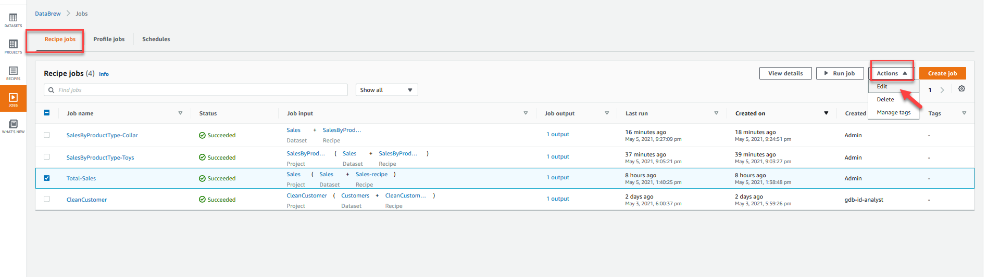
1. **Associated schedule** 으로 이동하여 **Hourly**을 선택하고 **Sav**을 선택합니다.

     
     
1. **Job Details**탭에서 관련 일정을 확인할 수 있으며 일정에 따라 작업이 진행됩니다.


### 4.4 Visualize In QuickSight

이 섹션에서는 데이터를 탐색하여 어떤 제품이 어느 지역에서 가장 많이 판매되는지 알아보겠습니다. 데이터를 탐색하기 위해 Amazon QuickSight를 사용할 것입니다. Amazon QuickSight는 클라우드용으로 구축된 확장 가능한 서버리스 임베디드형 머신 러닝 기반 비즈니스 인텔리전스(BI) 서비스입니다. QuickSight를 사용하면 머신 러닝 기반 인사이트가 포함된 대화형 BI 대시보드를 쉽게 만들고 게시할 수 있습니다. QuickSight 대시보드는 모든 기기에서 액세스할 수 있으며, 애플리케이션, 포털 및 웹사이트에 원활하게 임베드할 수 있습니다.

#### QuickSight 시작하기.
1. AWS 관리 콘솔에서 아래와 같이 검색 창에 QuickSight를 입력합니다:
   
1. QuickSight를 선택하면 QuickSight 시작 페이지가 표시됩니다. QuickSight에 가입하지 않은 경우 가입을 완료해야 할 수 있습니다. QuickSight에 가입하는 방법에 대한 자세한 안내는 여기에서 확인할 수 있습니다. 이 워크샵에서는 QuickSight Enterprise Addition에서만 사용할 수 있는 인사이트 및 머신 러닝을 사용합니다. 

가입을 완료하면 QuickSight에서 시작 마법사가 표시되며, 제시된 슬라이드를 자유롭게 살펴보세요. 슬라이드는 다음과 같은 형태로 나타납니다:
   


#### S3 액세스 권한 부여하기.
Amazon QuickSight 내에서 프로필 이름(오른쪽 상단)을 선택합니다. QuickSight 관리를 선택한 다음 보안 및 권한을 선택합니다.

추가 또는 제거를 선택합니다.

목록에서 Amazon S3를 찾습니다. 다음 중 하나를 선택합니다. 이러한 작업을 수행하면 S3 버킷을 선택할 수 있는 화면이 열립니다.

확인란이 선택 취소되어 있으면 Amazon S3 옆의 확인란을 사용 설정합니다.

확인란이 이미 사용 설정되어 있으면 세부 정보를 선택한 다음 S3 버킷 선택을 선택합니다.

Amazon QuickSight에서 액세스하려는 버킷을 선택합니다. 그런 다음 선택을 선택합니다.

업데이트를 선택합니다.

이 프로세스의 첫 번째 단계에서 AWS 리전을 변경한 경우 사용하려는 AWS 리전으로 다시 변경합니다.


#### 데이터 세트 만들기.
1. 이제 Amazon QuickSight 오리엔테이션을 완료하고 QuickSight를 실행했으므로 왼쪽 메뉴를 보고 데이터 세트를 선택합니다. 섹션 6.1에서 처리한 Total-Sales data를 가져올 것입니다.
   
1. 화면 오른쪽 상단에서 New Dataset button을 누르면 다음과 같이 표시됩니다:
1. 보시다시피 QuickSight는 여러 데이터 소스를 지원합니다. Twitter, Github, Snowflake, Redshift 등에서 데이터를 가져올 수 있습니다. 사용 가능한 데이터 소스의 전체 목록은 여기에서 설명서를 참조하세요. 데이터 소스 페이지에서 S3를 선택합니다.
   
1. S3 import에는 Data Source Name과 Manifest File이 필요합니다. 컴퓨터에서 텍스트 편집기를 사용하여 Manifest File 을 만듭니다. 파일의 구조는 다음과 같습니다:
```
{
    "fileLocations": [
        {
            "URIPrefixes": [
            "https://s3.amazonaws.com/glue-databrew-immersionday-xxxxxxxx/shared/Total-Sales_xxxxx/"
            ]
        }
    ],
    "globalUploadSettings": {
        "format": "CSV",
        "delimiter": ","
    }
}
```
1. manifest file은 섹션 6.1에서 생성한 폴더를 가리킵니다. manifest file에 대한 자세한 내용은 다음 문서를 참조하세요.
https://docs.aws.amazon.com/quicksight/latest/user/supported-manifest-file-format.html
1. 파일을 생성했으면 data.manifest 파일로 저장합니다. 파일에 올바른 버킷 이름이 포함되어 있는지, 폴더가 Total-Sales Data를 참조하는지 확인하세요.
1. 이제 manifest 파일을 만들었으므로 라디오 버튼을 URL에서 Upload로 변경하여 업로드합니다.  목록 파일 업로드 입력 상자 오른쪽에 있는 작은 파일 버튼을 사용하여 파일을 업로드합니다:
   
1. 그런 다음 Connect 버튼을 누릅니다. 그러면 데이터가 SPICE 데이터베이스에 업로드됩니다. 다음과 같은 확인 메시지가 표시됩니다:
   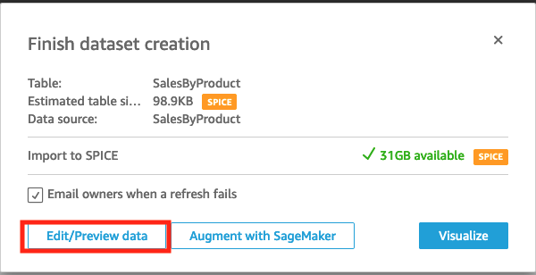

#### DataSet을 검토합니다.

1. Edit and Preview 버튼을 눌러 데이터를 확인합니다. 데이터를 로드하는 데 몇 초 정도 걸립니다. 자유롭게 탐색해 보세요.
1. 오른쪽에는 필드 목록이 표시되고 왼쪽에는 아래 데이터 샘플과 함께 dataset이 표시됩니다. QuickSight가 이미 Zip column이 우편번호임을 확인한 것을 알 수 있습니다.
   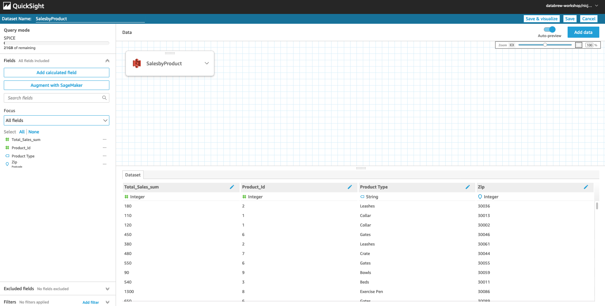
분석에 사용할 새 계산된 필드를 추가해 보겠습니다. 계산된 필드를 ProductStatus라고 부르며, 제품이 새 제품인지 오래된 제품인지를 나타냅니다.
화면 왼쪽에 있는 계산된 필드 Add를 누릅니다. 이름을 ProductStatus로 설정합니다.
오른쪽에 함수 목록이 표시되며, 함수를 선택하면 설명과 명령 구문이 표시됩니다. 기존 제품의 ID가 11 이하인 반면 모든 새 제품의 ID는 10보다 크다는 것을 알 수 있습니다. 제품이 신상품인지 구상품인지 확인하려면 IF 문이 필요합니다. 따라서 계산은 다음과 같습니다:
```
ifelse({Product_Id}<=11,'Old Product','New Product')
```
다음과 같이 계산에 입력합니다:
   
오른쪽 상단의 SAVE을 누르고 화면이 새로 고쳐질 때까지 기다립니다. 새로 생성된 계산된 필드를 탐색합니다.

#### 분석 만들기

1. 데이터 집합 화면에서 오른쪽 상단의 Save & Visualize버튼을 누릅니다.
1. 화면이 변경되고 빈 분석 화면이 표시됩니다. 오른쪽 상단에서 데이터를 성공적으로 가져온 것을 볼 수 있습니다.
1. 왼쪽에는 데이터 집합 내에 있는 필드 목록이 표시됩니다. 여기에는 새로 생성된 계산된 필드 제품 상태도 포함됩니다.
1. 오른쪽 상단의 작은 X를 눌러 가져오기 완료 알림을 닫을 수 있습니다.
   
1. 어떤 제품이 가장 많은 매출을 올렸나요?
1. 이 질문에 답하려면 왼쪽에서 제품 유형 및 총 매출을 선택합니다. 그래프가 변경되는 것을 확인할 수 있습니다.
   
1. 오른쪽 하단에서 원하는 유형을 선택하여 그래프 유형을 변경할 수 있습니다. 예를 들어 세로 막대 그래프로 변경해 보겠습니다:
   


#### 신제품과 기존 제품 판매 비교

1. 세로 막대 그래프를 보면 Exercise Pen이 가장 많이 판매된 품목임을 명확하게 알 수 있습니다. 하지만 신제품의 판매량은 이전 제품의 판매량과 어떻게 비교했을까요?
1. 그래프 위로 마우스를 이동하여 타원을 확인하고 클릭한 다음 시각적 복제 버튼을 누릅니다.
   
오른쪽 상단의 화살표를 눌러 메뉴를 확장하고 새롭게 복제 그래프가 선택되어 있는지 확인합니다
   
화면 상단에 Field Wells을 볼 수 있어야 합니다. 필드 열에서 Field Wells로 필드를 끌어 color field well에 계산된 필드 Product Status를 추가합니다. 그래픽의 크기도 자유롭게 조정할 수 있습니다. 다음은 표시되는 내용의 예입니다:
   


#### 위치별 매출

지도를 추가하여 위치별 매출을 좀 더 자세히 분석해 보겠습니다. 화면 오른쪽 상단에서 다음과 같이 Add Visual 를 선택합니다:
   
새 visual이 강조 표시되어 있는지 확인하고 필드를 선택합니다: Total Sales Sum  및 Zip를 선택합니다. 그런 다음 오른쪽 아래 Visual Types 셀에서 맵 버튼을 선택하여 Visual Types을 map으로 변경합니다.
   
1. 지도에는 신상품과 구상품을 포함한 모든 제품의 매출이 표시됩니다. 이를 변경하여 Zip Code(우편번호)별 New Product sales(새 제품 판매량)을 표시하는 그래프와 Old Product sales(기존 제품 판매량)을 표시하는 그래프 두 개를 만들겠습니다.
1. 텍스트가 Sum of Total_sales_sum by Zip인 것을 확인하고 텍스트를 클릭하여 Total Sales by Zip for the Old Product으로 변경합니다. visual을 선택한 상태에서 맨 오른쪽의 Filters 버튼을 누릅니다. 이제 맵에 Filters를 적용하여 Old Product sales (기존 제품 판매량)만 표시하겠습니다.
   
1. 필터에서 파란색 Create one option을 누릅니다. 필드 목록이 포함된 메뉴가 나타납니다.
1. Product Status를 선택합니다. 필터가 이 visual에만 적용된다는 점에 유의하세요. Ellipse(...) 버튼을 누른 다음 edit을 누릅니다.
1. Select All을 취소하고 다음과 같이 Old Product을 선택합니다:
   
 1. Apply 버튼을 눌러 변경 사항을 적용합니다. 이제 이전 제품의 판매량을 표시하는 맵이 생겼습니다. 이전에 수행한 복제 기능을 사용하여 맵을 duplicate(복제)한 다음 새로 만든 맵을 업데이트하여 새 제품에 대해 필터링합니다. 결과는 다음과 같아야 합니다:
    


#### 우편번호별 제품

1. 그래프를 하나 더 추가한 다음 서로 연결해 보겠습니다. 이 visual에서는 Zip Code(우편번호)별 제품 판매량을 비교하고 New Product (새 제품)과 Old Product(기존 제품)을 비교합니다.
1. 오른쪽 상단의 Add 버튼을 사용하여 new visualization를 추가하고, 텍스트를 업데이트하고, 시각화를 확장합니다. 다음과 같은 내용이 표시됩니다:
    


#### 분석

1. 새 그래프를 보완하기 위해 테이블을 추가해 보겠습니다. 오른쪽 상단의 추가 버튼을 사용하여 new visualization를 추가하고, visualization를 pivot table로 변경하고, 행으로 Zip을 추가하고, 열로 Product Status를 추가하고, 값으로 Total Sales Sum을 사용합니다.
1. New Product의 Total Sales을 클릭하고 sort ascending(오름차순 정렬)을 선택합니다. 다음과 같은 시각화가 표시됩니다:
    
1. 지역별 제품 판매를 이해하기 위해 visualizations 동작을 추가할 수 있습니다.
1. 처음 만든 그래프를 선택하고 ellipses(...)에서 작업을 선택합니다:
    
1. 오른쪽에서 Define new action를 누르고 아래 내용을 확인하여 Apply를 클릭합니다.
activation : Select
action type : filter action
field scope : all fields
target visuals : all visuals
   
이제 모든 시각화가 서로 연결되었으므로 첫 번째 시각화에서 제품을 선택하고 나머지 그래프가 어떻게 업데이트되는지 확인할 수 있습니다.
예를 들어 첫 번째 그래프에서 collar를 선택하면 모든 시각화가 업데이트되는 것을 알 수 있습니다.
   
   
   
그래프에서 Collar를 선택하면 대부분의 지역에서 기존 제품이 신제품보다 더 많이 팔린다는 것을 명확하게 알 수 있습니다. 신제품이 전혀 판매되지 않는 지역도 있습니다.

## 5. Feature Engineering

### 5.1 Connect a new dataset

새 데이터 세트 연결
해당 세션에서 사용할 dataset은 접두사가 glue-databrew-immersionday인 S3 버킷의 feature-engineering 폴더에 있습니다.
해당 데이터 세트에 연결하려면 다음과 같이 하세요:

1. 왼쪽 메뉴에서 **DATASETS**를 선한 다음
1. 화면 오른쪽에 있는 Connect new dataset 을 클릭합니다.
   
1. DataSet name은 databrew-immersion-day-feature-engineering-census-adult로 입력하고, S3 소스를 입력하고, 파일 유형으로 CSV를 선택하고, 구분 기호로 Comma(쉼표)를 선택하고, Treat first row as a header(첫 번째 행을 헤더로 처리)를 선택합니다.
1. Create dataset 버튼을 클릭합니다.
   
   
dataset가 연결되면 메인 화면의 Dataset dashboard에 dataset 이름이 표시됩니다.
   
1. 최근에 만든 데이터 세트에서 data profile job 을 실행합니다. 지침은 모듈 5.2 데이터 프로파일 작업을 참조하세요. data profile 결과를 사용하여 Feature Engineering에 도움을 받을 수 있습니다


### 5.2 Create a project

1. 새 프로젝트를 만들기 위해 왼쪽 메뉴에서 **PROJECTS**를 클릭하고
1. 오른쪽에서 Create project 버튼을 클릭합니다.
   
1. Project name를 immserionday-feature-engineering으로 입력합니다.
   
1. My dataset을 클릭한 다음 dataset name을 선택하여 이전에 생성한 데이터 집합을 선택합니다.
   
1. **Permissions** 섹션의 **Role name**를 드롭다운하여 *AWSGlueDataBrewServiceRole-ID* 역할을 선택합니다.
1. 오른쪽 하단에 **Create project**을 선택합니다.
DataBrew가 새 세션을 시작합니다.
   
세션이 시작되면 각 데이터 컬럼에 대한 메트릭이 포함된 데이터 샘플이 표시되며, DataBrew recipe를 만들 준비가 완료됩니다.
databrew-project-initiation
   

### 5.3 Handling data quality

#### Handling data quality

1. 먼저 앞서 수행한 Data Profile의 결과를 살펴봅니다. valid(유효성)이 100% 미만인 열이 세 개 있습니다.( workclass, occupation, and capital.loss.)Workclas과 occupation 컬럼은 데이터의 6%가 누락되었습니다.

   
1. 데이터 품질을 보려면 해당 컬럼을 선택합니다. 이 경우 workclass를 살펴보겠습니다.:
   
1. 5%의 값이 누락된 것을 볼 수 있습니다. dataset의 5%가 무시할 수 있는 수준이라고 판단되면 이 행을 제거하도록 선택하여, dataset에서 제거할 수 있습니다.


#### Removing Rows with Empty Values

missing values(누락된 값을 처리하는 방법에는 여러 가지가 있습니다. 한 가지 방법은 DataBrew를 사용하여 빈 값이 있는 행을 제거하는 것입니다. 

1. source 컬럼(workclass)을 선택하고 상단에 Missing 아이콘을 클릭한 다음
1. Remove missing rows를 클릭합니다.
   
1. 오른쪽에서 source column으로 workclass를 확인하고, Miss value action으로 Delete rows with missing values(누락된 값 삭제)를 클릭합니다.
   
1. 오른쪽에서 아래로 스크롤하여 All rows 을 선택하고 Apply를 클릭합니다.
   

#### Fill in Missing Values (누락된 값 채우기)

행을 삭제할 상황이 안 되거나 누락된 기능에 값을 제공하려는 경우 DataBrew를 사용하여 다양한 옵션으로 채울 수 있습니다. 여기서는 median value(중앙값)으로 채우겠습니다.

1. source 컬럼(capital.loss)을 선택하고 상단에서 Missing 아이콘을 선택한 후 Fill with numeric aggregate(숫자 집계로 채우기)를 선택합니다.
  
1. 오른쪽에서 source column으로 capital.loss을 확인하고, Fill with numeric aggregate(숫자 집계로 채우기)를 선택한 다음 Median(중앙값) numeric aggregate 숫자 집계를 선택합니다.
  
1. 오른쪽에서 아래로 스크롤하여 All rows 을 선택하고 Apply를 클릭합니다.
   

#### Excluding Outliers(이상값 제외)

매우 정확하지 않은 값을 포함하는 데이터의 경우 이상값을 찾아 dataset에서 제거할 수 있습니다. 이상값이 있는 열을 선택합니다.

1. Data Profile 을 살펴보고 Column statistics(컬럼 통계)를 클릭한 다음 capital.loss 컬럼을 클릭합니다.
1. 오른쪽에서  Data insights까지 아래로 스크롤합니다.
   
그러면 두 개의 이상값이 있으며 그 수가 충분히 적으므로 이 행을 안심하고 제거할 수 있음을 알 수 있습니다.
1. source 컬럼(capital.loss)을 선택하고, Outliers 아이콘을 클릭하고 Remove outliers를 클릭합니다.
   
1. 오른쪽에서 source column으로 capital.loss을 확인하고, Z-score outliers을 선택하고, Standard deviation threshold에 3을 입력합니다.   
1. 아래로 스크롤하여 Remove outliers를 클릭합니다. Remove outliers에서 All outliers을 선택합니다.
   
1. 그런 다음 Delete rows를 클릭하고 Apply을 클릭합니다.
   


### 5.4 Scaling data

#### Binning

연속형 숫자 변수를 범주형(Category)형태의 변수로 변환하려면 binning를 사용하는 것이 일반적인 방법입니다.

1. Binning를 적용할 source 컬럼(education.num)을 선택하고, Scale 아이콘을 클릭한 다음 Binning을 선택합니다.
   
1. 아래에서 데이터 분포에 대한 요약을 확인할 수 있습니다.   
   
1. Fixed range를 선택하여 고정 값의 bins을 생성합니다.
   
1. Add another bin를 클릭하여 구간차원 값을 하나 더 추가합니다.
   
1. Bin names을 아래 스크린샷에 정의된 값으로 변경합니다.
1. Bin 범위 값을 재분배하려면 auto distribution range를 클릭합니다.
   
1. 값이 어떻게 재분배되었는지 확인합니다.
   
1. destination column 이름을 education_num_bin으로 입력하고 Apply을 클릭합니다.
   
1. binned values으로 구분된 값으로 새 컬럼을 볼 수 있습니다.
   

#### Log Transformation

Log Transformation(로그 변환)은 왜곡된 데이터 분포를 정상적으로 만드는 데 자주 사용됩니다. 

1. 로그를 변환할 source 컬럼(age)을 선택합니다.
1. 그런 다음 Create 아이을 클릭하고 Based on a function를 선택합니다.
   
1. 오른쪽에서 아래 값으로 채워줍니다.
select function : LOG
Values using : Source column
Base(로그 기준) : 10
   
1. 아래로 스크롤하여 Destination column에 age_log를 입력해주고, Apply transform 대상으로 All rows에 변환을 선택한 후 Apply 클릭합니다.
   
1. 새 컬럼에서 결과를 검토합니다.
   

#### One-Hot-Encoding

머신러닝 알고리즘은 입력 변수가 숫자이어야 하는 label data에는 직접적으로 작동할 수 없는 경우가 많습니다. 
One-Hot-Encoding은 서로 연관성이 없는 범주형 데이터를 숫자 데이터로 변환하는 기술입니다.    

1. 인코딩할 source 컬럼(education)를 선택하고 encode 아이콘을 클릭한 후 One-hot encode 열을 선택합니다.
   
1. 아래로 스크롤하여 All rows을 선택하고 Apply을 클릭합니다.
   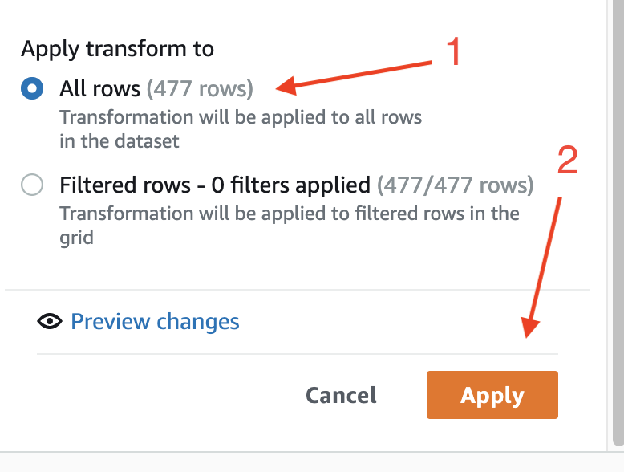
1. DataBrew는 dataset의 label을 기반으로 필요한 컬럼을 생성하고 1과 0으로 적절하게 인코딩합니다.
   

#### Categorical Mapping

불연속형 값의 범주형 매핑을 순서가 없는 값 또는 순서가 있는 숫자 집합으로 만들려면 다음과 같이 하세요:

1. 변환할 source 컬럼(workclass) 클릭한 다음 Mapping 아이콘을 클릭하고 Categorical mapping을 선택합니다.
   
1. source column으로 workclass 확인하고, Mapping options으로 map all values 을 선택한 다음 Map values to numeric values을 체크합니다.
   
1. 불연속형 카테고리를 적절한 숫자 값에 매핑합니다.
   
1. Destination Colum에 workclass_mapped를 입력하고 All rows을 적용한 다음 Apply을 클릭합니다.
   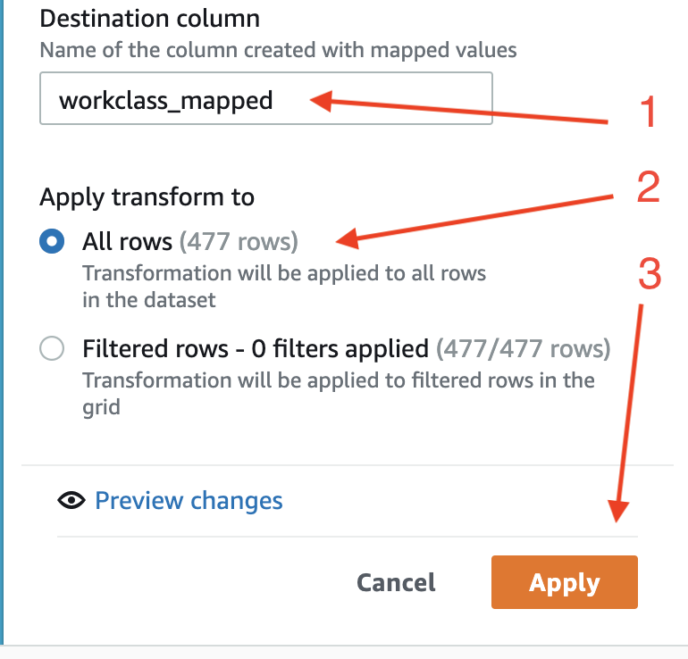
1. 결과를 확인합니다. 매핑된 값은 두 자리 수이며 소수점이 있습니다.
   
1. 컬럼 이름 옆의 #을 클릭하고 integer를 선택하여 변경할 수 있습니다.
   
1. 이제 매핑된 integer 값으로 형식이 지정됩니다.
   

### 5.5 Normalization

#### Normalization

range가 다른 features(특성)의 경우 정규화는 값 범위의 차이를 변형하지 않고 dataset의 numeric columns 값을 바꿔줍니다.
DataBrew에서는 다양한 정규화 방법을 사용할 수 있습니다. 여기서는 두 가지 방법을 사용합니다: Min-max 정규화와 Z-score 정규화입니다:
age column을 선택하고 Scale을 클릭한 다음 Min-max normalization를 선택합니다.

#### Min-Max Normalization

1. *age column*을 선택하고 **Scale**을 클릭한 다음 **Min-max normalization**를 선택합니다.
   
1. 아래로 스크롤하여 **Destination column**을 `age_normalized_mean_max`로 입력하고 **All rows**을 클릭한 다음 **Apply**을 클릭합니다.
   
1. 샘플 데이터를 확인하여 **Min-Max 정규화**된 데이터가 포함된 새 컬럼을 확인합니다.
   

#### Z-점수 정규화

1. *age column*을 선택하고 **Scale**을 클릭한 다음
1. **Z-score normalization**를 선택합니다.
  
1. 아래로 스크롤하여 **Destination column**을 `age_normalized_z_score`로 입력하고 **All rows**을 클릭한 다음 **Apply**을 클릭합니다.
  
1. 샘플 데이터를 확인하여 **z-score 정규화**된 데이터가 포함된 새 컬럼을 확인합니다.
  


